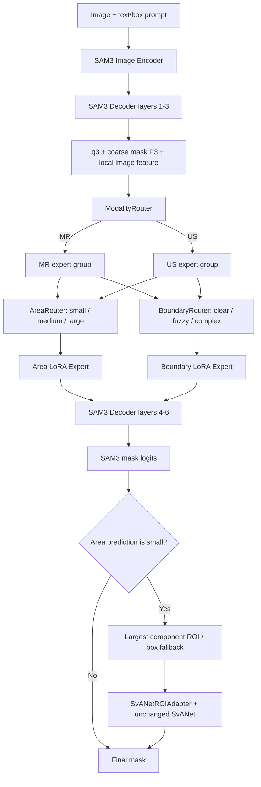

# Hierarchical LoRA-MoE-SAM3 with SvANet Refinement

面向MR/US医学图像分割的层级路由LoRA专家系统与小目标二阶段细化框架。

## 1. 项目简介

本项目在现有 SAM3 + LoRA 微调代码上增加了层级 MoE 路由和 SvANet 小目标细化，同时保留原始 `train.py` 训练入口。系统只构建一个 SAM3 backbone，不为 MR 和 US 复制模型；模态、面积和边界专家都是低秩增量，而不是完整网络。

真实执行路径如下：SAM3 decoder 的前 3 层先产生 `q3`；`HierarchicalRouter` 使用局部图像特征、`q3` 和粗掩码 `P3` 输出模态、面积和边界路由；decoder 第 4–6 层的注意力投影叠加一个 Area LoRA Expert 和一个 Boundary LoRA Expert。推理时，如果 Area Router 将样本判断为 `small`，`SvANetROIAdapter` 会裁剪 ROI、调用未修改结构的 SvANet，并把细化结果贴回 SAM3 mask。



已实现的核心能力：

- `ModalityRouter` 输出 MR/US 二分类结果。
- 每个模态组包含 `small`、`medium`、`large` 三个面积专家和 `clear`、`fuzzy`、`complex` 三个边界专家，共 12 个 `LoRAExpert`。
- 每个样本同时激活 Area 和 Boundary 两个专家，支持 `top1` 与 `soft` 路由。
- `PatientDataset` 先选择 patient，再展开 slice；支持指定 patient ID 或按数量随机/顺序选择。
- Stage 4/5 支持 small-area ROI 的 SvANet 二阶段细化。
- 训练时支持内置 validation、patient-level 指标、分阶段 checkpoint 和同阶段 resume。

## 2. 代码结构

```text
HMOE-SAM3/
├── README.md
├── unified_preprocess_and_coco_20260410.py  # 3D MR/US -> 504×504 PNG + 初始 COCO
├── trans_format.py                          # 最终 COCO + SAM3 XYXY boxes
├── MedSAM3-main/
│   ├── train.py                             # 保留的原始 SAM3 + LoRA 入口
│   ├── train_moe_sam3.py                    # Hierarchical MoE 分阶段训练入口
│   ├── train_sam3_lora_native.py            # SAM3TrainerNative 与实际 train/val loop
│   ├── infer_moe_sam3.py                    # MoE + 可选 SvANet 推理入口
│   ├── validate_sam3_lora.py                # 仅原始 LoRA 验证，不加载 MoE stage checkpoint
│   ├── configs/
│   │   ├── moe_sam3.yaml                    # 主配置
│   │   └── moe_sam3_smoke.yaml              # 小规模 smoke 配置示例
│   ├── data/
│   │   ├── patient_dataset.py               # PatientDataset / PatientSliceRecord
│   │   ├── sample_index.py                  # COCO、box key 和路径校验
│   │   ├── area_labels.py                   # 面积比例和伪标签
│   │   └── boundary_labels.py               # 边界特征和伪标签
│   ├── models/
│   │   ├── moe_lora.py                      # LoRAExpert / ExpertPool / RoutedMoELinear
│   │   ├── router.py                        # ModalityRouter / AreaRouter / BoundaryRouter
│   │   ├── moe_injector.py                  # HierarchicalMoEController 与注入逻辑
│   │   ├── moe_losses.py                    # HierarchicalMoELoss
│   │   ├── svanet_roi_adapter.py            # SvANet 构建、ROI 裁剪与回贴
│   │   ├── training_stages.py               # StageTrainingManager
│   │   ├── training_metrics.py              # EpochStatistics
│   │   └── inference_utils.py                # 推理查询和路由结果处理
│   ├── tools/                                # 数据、forward、梯度和 ROI 调试工具
│   └── tests/                                # MoE/stage/metrics 单元测试
└── SvANet-main/                              # 原始 SvANet 网络代码，结构未改动
```

### 2.1 LoRA 与 MoE 的真实注入位置

原始共享 LoRA 由 `apply_lora_to_model()` 按 `lora.target_modules` 及各 `apply_to_*` 开关注入。MoE 由 `inject_hierarchical_moe()` 额外注入到 SAM3 decoder 的 Python 索引 `3:6`，即第 4–6 层。每层处理 `self_attn`、`ca_text`、`cross_attn`，并包装其中存在的 `q_proj`、`k_proj`、`v_proj`、`out_proj`；当前模型共打印 36 个 routed attention projections。

`RoutedMoELinear` 保留原投影（原投影本身可以已经是 `LoRALinear`），然后计算：

```text
y = base_projection(x) + area_expert_delta(x) + boundary_expert_delta(x)
LoRAExpert(x) = scaling * B(A(dropout(x)))
scaling = alpha / rank
```

12 个专家构成一个共享 `ExpertPool`，不是每个投影各自复制 12 个专家。`top1` 模式只执行被选中的稀疏专家；`soft` 模式按概率加权所有候选专家。

### 2.2 Router 的实际输出

`HierarchicalRouter.forward(q3, local_image_feature)` 接收 `q3[queries,batch,C]` 和 `local_image_feature[batch,C,H,W]`，内部产生 `coarse_mask_p3[batch,queries,H,W]`，并返回：

- `modality_logits[batch,2]`、`modality_soft`、`modality`；类别顺序为 `MR, US`。
- `area_logits[batch,3]`、`area_soft`、`area`、`area_ratio_pred[batch]`；类别顺序为 `small, medium, large`。
- `boundary_logits[batch,3]`、`boundary_soft`、`boundary`；类别顺序为 `clear, fuzzy, complex`。
- `area_joint[batch,2,3]` 和 `boundary_joint[batch,2,3]`，用于选择具体模态组中的专家。

## 3. 环境安装

`setup.py` 声明 Python `>=3.8`，`requirements.txt` 声明 PyTorch `>=2.7.0`。建议使用带 CUDA 的 PyTorch 环境；代码在无 CUDA 时会回退到 CPU，但完整 SAM3 训练通常不适合 CPU。

```bash
cd /path/to/project/MedSAM3-main
python -m venv .venv
source .venv/bin/activate
python -m pip install --upgrade pip
python -m pip install -r requirements.txt
python -m pip install -e .
```

Windows PowerShell 激活命令：

```powershell
cd /path/to/project/MedSAM3-main
python -m venv .venv
.venv/Scripts/Activate.ps1
python -m pip install --upgrade pip
python -m pip install -r requirements.txt
python -m pip install -e .
```

运行 3D 预处理还需要 `SimpleITK`：

```bash
python -m pip install SimpleITK
```

## 4. 数据准备

### 4.1 目录约定

patient 目录必须是纯数字名称，不使用 `patient_001`。推荐同时准备 train、val、test：

```text
/path/to/dataset/
├── mr-2d/
│   ├── train/1/slice_0000.png
│   ├── val/1/slice_0000.png
│   ├── test/1/slice_0000.png
│   ├── train.json
│   ├── val.json
│   ├── test.json
│   ├── train_boxes_xyxy.json
│   ├── val_boxes_xyxy.json
│   └── test_boxes_xyxy.json
├── mr-mask-2d/
│   ├── train/1/slice_0000.png
│   ├── val/1/slice_0000.png
│   └── test/1/slice_0000.png
├── us-2d/
│   └── ...
└── us-mask-2d/
    └── ...
```

`PatientDataset` 从路径解析信息：根目录决定 `modality`，第一级数字目录转成 `patient_id=int(folder_name)`，文件 stem 作为 `slice_id`。patient 信息不依赖 COCO 自定义字段。

### 4.2 3D 预处理

`unified_preprocess_and_coco_20260410.py` 没有命令行参数。运行前直接检查脚本顶部常量，尤其是 `DATA_ROOT`、`OUT_ROOT`、`SUBSETS`、`MODALITIES`、`TARGET_SIZE`、`TARGET_SPACING`、`VIEW_BY_MODALITY`。当前仓库脚本中 `MODALITIES` 被连续赋值两次，最终有效值是 `['us']`；若需要同时导出 MR/US，必须先将这一配置值改为预期模态。这属于数据脚本配置，不是训练配置。

```bash
cd /path/to/project
python unified_preprocess_and_coco_20260410.py
```

脚本输出 504×504 PNG、独立 mask PNG 和初始 COCO。训练不直接读取这份初始 JSON，必须再运行 `trans_format.py`。

### 4.3 生成最终 COCO 与 box prompt

以 MR train 为例：

```bash
cd /path/to/project
python trans_format.py \
  --input-json /path/to/dataset/mr-2d/train_initial.json \
  --mask-root /path/to/dataset/mr-mask-2d \
  --output-json /path/to/dataset/mr-2d/train.json \
  --boxes-json /path/to/dataset/mr-2d/train_boxes_xyxy.json \
  --category-name prostate
```

对 MR/US 的 train、val、test 分别执行。`--category-name` 可省略；省略时沿用输入中的第一个前景类别。`--mask-root` 可省略，但传入后会把二值 PNG 编码为 compressed COCO RLE 并写入 `annotations.segmentation`。

`trans_format.py` 的实际行为：

- 重新生成唯一的 `images.id`。
- 将 `annotations.image_id` 映射到新的 image ID。
- 保留或生成 `annotations.segmentation`；提供 `--mask-root` 时生成 RLE。
- COCO `bbox` 保持 `[x,y,w,h]`。
- box prompt 另存为 `[x1,y1,x2,y2] = [x,y,x+w,y+h]`。
- `canonical_training_file_name()` 将 `train/1/slice_0000.png` 规范为 `1/slice_0000.png`，避免 `image_root/train/train/...`。

最终 COCO 至少需要：

```json
{
  "images": [
    {"id": 0, "file_name": "1/slice_0000.png", "width": 504, "height": 504}
  ],
  "annotations": [
    {
      "id": 0,
      "image_id": 0,
      "category_id": 1,
      "bbox": [100.0, 120.0, 30.0, 40.0],
      "area": 1200.0,
      "segmentation": {"size": [504, 504], "counts": "..."},
      "iscrowd": 0
    }
  ],
  "categories": [
    {"id": 1, "name": "prostate", "supercategory": "object"}
  ]
}
```

当 `segmentation` 为空时，配置中必须提供可解析的 `mr_mask_root`/`us_mask_root`；否则 `validate_final_coco()` 会拒绝数据。训练使用 `trans_format.py` 生成的最终 JSON，而不是初始 JSON。

### 4.4 patient-first 选择与伪标签阈值

显式 `patient_ids` 优先于 `num_mr_patients`/`num_us_patients`。未显式指定时，`PatientDataset` 先扫描并选择数字 patient 目录，再展开其 `slice_*.png`，不会先打散所有 slice。

面积和边界 Router 训练需要阈值文件。阈值工具读取一个已确定 patient 划分的 manifest。manifest 最小格式为：

```json
{
  "mr_patient_ids": [1, 2, 3],
  "us_patient_ids": [1, 2, 3]
}
```

然后执行：

```bash
cd /path/to/project/MedSAM3-main
python tools/compute_area_thresholds.py \
  --config configs/moe_sam3.yaml \
  --selected-patients /path/to/dataset/selected_patients.json \
  --output /path/to/dataset/area_thresholds.json

python tools/compute_boundary_thresholds.py \
  --config configs/moe_sam3.yaml \
  --selected-patients /path/to/dataset/selected_patients.json \
  --output /path/to/dataset/boundary_thresholds.json
```

仅使用 train patient 计算阈值，然后将两个输出路径分别写入 `dataset.area_threshold_file` 和 `dataset.boundary_threshold_file`。训练开始后还会把实际选中的 train/val patient 记录到 `selected_patients_json` 和 `selected_val_patients_json`。

### 4.5 Dataset 实际字段

`PatientSliceRecord` 保存 `image_path`、`relative_file_name`、`patient_id`、`slice_id`、`slice_index`、`modality`、`split`、`base_dataset_index`、`image_id`、`mask_path`、`box_prompt`、`text_prompt`、`modality_label`、`area_ratio`、`area_label`、`boundary_contrast`、`boundary_complexity`、`boundary_label` 和 `boundary_fallback`。

训练默认使用 `return_format: sam3`，即返回与原 SAM3 `collate_fn_api` 兼容的 datapoint，并通过 `patient_metadata` 附加上述元数据。`return_format: dict` 或 `PatientDataset.get_moe_sample()` 返回：

```text
image, mask_gt, box_prompt, text_prompt, modality_label,
patient_id, slice_id, area_ratio, area_label,
boundary_contrast, boundary_complexity, boundary_label,
image_path, mask_path
```

其中 `modality_label` 为 MR=0、US=1；`area_label` 为 small=0、medium=1、large=2；`boundary_label` 为 clear=0、fuzzy=1、complex=2。

## 5. 配置

建议复制 `MedSAM3-main/configs/moe_sam3.yaml` 后修改。下面展示运行所需的关键字段；所有路径都应替换为实际位置。

```yaml
model:
  sam3_checkpoint: /path/to/checkpoint/sam3.pt
  stage1_checkpoint: ""
  stage2_checkpoint: ""
  stage3_checkpoint: ""
  stage4_checkpoint: ""

lora:
  rank: 8
  alpha: 16
  dropout: 0.0
  target_modules: [q_proj, k_proj, v_proj, out_proj, qkv, proj, fc1, fc2, c_fc, c_proj, linear1, linear2]
  apply_to_vision_encoder: true
  apply_to_text_encoder: true
  apply_to_geometry_encoder: true
  apply_to_detr_encoder: true
  apply_to_detr_decoder: true
  apply_to_mask_decoder: true

moe:
  enabled: true
  rank: 8
  alpha: 16
  dropout: 0.0
  embed_dim: 256
  router_hidden_dim: 256
  routing_mode: top1
  temperature: 1.0

router:
  routing_type: top1
  use_gt_modality_during_train: true
  use_gt_area_during_warmup: true
  use_gt_boundary_during_warmup: true
  teacher_forcing:
    enabled: true
    start_ratio: 1.0
    end_ratio: 0.0
    decay_epochs: 20

dataset:
  mr_root: /path/to/dataset/mr-2d
  mr_mask_root: /path/to/dataset/mr-mask-2d
  us_root: /path/to/dataset/us-2d
  us_mask_root: /path/to/dataset/us-mask-2d
  mr_coco_json: /path/to/dataset/mr-2d/{split}.json
  us_coco_json: /path/to/dataset/us-2d/{split}.json
  mr_boxes_json: /path/to/dataset/mr-2d/{split}_boxes_xyxy.json
  us_boxes_json: /path/to/dataset/us-2d/{split}_boxes_xyxy.json
  train_split: train
  val_split: val
  num_mr_patients: 50
  num_us_patients: 50
  patient_ids:
    mr: []
    us: []
  patient_sampling:
    mode: random
    seed: 42
  num_mr_val_patients: null
  num_us_val_patients: null
  val_patient_ids:
    mr: []
    us: []
  val_patient_sampling:
    mode: sequential
    seed: 42
  resample_patients_each_epoch: false
  strict_dataset_check: true
  return_format: sam3
  area_threshold_file: /path/to/dataset/area_thresholds.json
  boundary_threshold_file: /path/to/dataset/boundary_thresholds.json

svanet:
  enable: true
  source_root: /path/to/project/SvANet-main
  checkpoint: ""
  backbone_checkpoint: /path/to/checkpoint/resnet50.pth
  shared_across_modalities: true
  input_size: [512, 512]
  roi_expand_ratio: 0.25
  min_roi_size: 32
  mask_threshold: 0.5
  train_trigger: teacher_forcing
  empty_mask_fallback: box_then_full_image
  paste_mode: replace_roi
  outside_roi: zero
  use_gt_roi_for_warmup: true
  gt_roi_warmup_epochs: 2

training:
  stage: 1
  epochs: 20
  batch_size: 1
  num_workers: 4
  learning_rate: 0.00005
  weight_decay: 0.0001
  data_dir: ""
  resume: ""
  validation_interval: 1
  scheduler:
    enabled: false
    type: cosine
    eta_min: 0.0

output:
  output_dir: outputs/hierarchical_moe_sam3
```

注意：

- `router.routing_type` 会覆盖 `moe.routing_mode`，可取 `top1` 或 `soft`。
- `model.sam3_checkpoint` 非空时由 `build_sam3_image_model()` 从该本地权重构建；为空时会设置 `load_from_HF=true`，需要可访问对应的 Hugging Face 权重。
- 实际专家超参数来自 `moe.rank`、`moe.alpha`、`moe.dropout`；共享 LoRA 超参数来自 `lora.*`。
- 当前 MoE 注入层和投影由代码固定为 decoder 第 4–6 层的三类 attention 的四个 projection；主配置中的 `model.moe_decoder_layers` 和 `model.moe_target_modules` 目前不控制注入逻辑。
- `router.modality_hidden_dim`、`area_hidden_dim`、`boundary_hidden_dim` 目前不分别生效，三个 Router 使用 `moe.router_hidden_dim`。
- `training.amp` 当前未接入 autocast/GradScaler，设置该字段不会启用 AMP。
- `resample_patients_each_epoch: true` 当前未实现，会抛出 `NotImplementedError`。
- `svanet.shared_across_modalities: true` 对应当前单一共享 SvANet。分别使用 `mr_checkpoint`/`us_checkpoint` 的双实例逻辑当前未实现。
- `svanet.checkpoint` 是完整 SvANet checkpoint；`svanet.backbone_checkpoint` 只把 torchvision ResNet-50 权重映射到 SvANet encoder，不代表已有训练好的分割头。

## 6. 训练

`train_moe_sam3.py` 的用户参数为：`--config`（默认 `configs/moe_sam3.yaml`）、`--device`（一个或多个 GPU 编号，默认 `0`）、`--master_port`（默认 `29500`）、`--local_rank`、`--stage`（1–5）和 `--resume`。`--_launched_by_torchrun` 是入口内部使用的隐藏参数，不需要手工传入。

### 6.1 五阶段训练

`--stage` 优先于 `training.stage`。各阶段的实际可训练参数和损失门控如下：

| Stage | 名称 | 默认可训练参数 | 生效损失 |
|---:|---|---|---|
| 1 | `baseline` | `shared_lora` | `sam3_loss`, `aux_loss` |
| 2 | `router` | `router`, `auxiliary_head` | `aux_loss`, `modality_loss`, `area_loss`, `area_reg_loss`, `boundary_router_loss` |
| 3 | `moe` | `expert_lora` | `sam3_loss`, `boundary_seg_loss`, `load_balance_loss` |
| 4 | `svanet` | `svanet` | `refine_loss` |
| 5 | `joint` | `router`, `auxiliary_head`, `expert_lora`, decoder 第 4–6 层, `svanet` | 全部 MoE/SAM3/refine losses |

附加开关位于 `stages`：`train_decoder_stage1`、`use_aux_loss_stage1`、`train_router_stage3`、`use_router_losses_stage3`、`train_shared_lora_stage5`。

Stage 依赖加载规则：Stage 2 读取 `model.stage1_checkpoint`；Stage 3 读取 Stage 1+2；Stage 4 读取 Stage 3；Stage 5 读取 Stage 3+4。空路径会被跳过。

```bash
cd /path/to/project/MedSAM3-main

python train_moe_sam3.py --config configs/moe_sam3.yaml --stage 1 --device 0
python train_moe_sam3.py --config configs/moe_sam3.yaml --stage 2 --device 0
python train_moe_sam3.py --config configs/moe_sam3.yaml --stage 3 --device 0
python train_moe_sam3.py --config configs/moe_sam3.yaml --stage 4 --device 0
python train_moe_sam3.py --config configs/moe_sam3.yaml --stage 5 --device 0
```

运行下一阶段前，把上一阶段生成的 `stageN_*_best.pt` 写回对应的 `model.stageN_checkpoint`。

### 6.2 一次训练 Stage 5

代码允许不经过五阶段、直接训练 Stage 5：把 `model.stage1_checkpoint` 至 `stage4_checkpoint` 留空，然后运行：

```bash
cd /path/to/project/MedSAM3-main
python train_moe_sam3.py \
  --config configs/moe_sam3.yaml \
  --stage 5 \
  --device 0
```

这会从 `model.sam3_checkpoint`、共享 LoRA/Router/Expert 的初始化值，以及 `svanet.checkpoint` 或 `svanet.backbone_checkpoint` 开始联合训练。它是已支持的执行方式，但不是等价于加载各阶段最优参数的 staged training。

### 6.3 多 GPU、resume 与 scheduler

```bash
cd /path/to/project/MedSAM3-main
python train_moe_sam3.py \
  --config configs/moe_sam3.yaml \
  --stage 5 \
  --device 0 1 \
  --master_port 29500
```

入口会自动通过 `torch.distributed.run` 启动多进程。resume 只允许同 stage checkpoint，并恢复 model、controller、SvANet、optimizer 和可用的 scheduler state：

```bash
cd /path/to/project/MedSAM3-main
python train_moe_sam3.py \
  --config configs/moe_sam3.yaml \
  --stage 5 \
  --resume /path/to/checkpoint/stage5_joint_best.pt \
  --device 0
```

已实现的 scheduler 类型为 `cosine` 和 `step`；由 `training.scheduler.enabled` 启用，每个 epoch 后执行一次 `step()`。

### 6.4 原始 SAM3 + LoRA

MoE 入口是独立的；原始流程仍使用：

```bash
cd /path/to/project/MedSAM3-main
python train.py \
  --config /path/to/project/MedSAM3-main/configs/train_config.yaml \
  --device cuda
```

`train.py` 与 MoE 的 `StageTrainingManager`、12 个专家和 SvANet ROI 流程无关。请注意，当前仓库中的 `configs/base_config.yaml` 与这个入口读取的字段结构并不完全一致，不能直接作为上述 `train_config.yaml`；原始入口要求配置包含 `paths.bpe_path`、COCO `dataset.*`、完整 `training.*`、`logging.log_dir` 和 `checkpoint.*`。这是保留入口，不是 MoE 推荐入口。

## 7. Loss、日志与 checkpoint

`HierarchicalMoELoss` 实际包含：

- `sam3_loss`：final logits 的 Dice + BCEWithLogits。
- `aux_loss`：`P3` coarse logits 的 Dice + BCEWithLogits。
- `modality_loss`、`area_loss`、`boundary_router_loss`：分类交叉熵。
- `area_reg_loss`：`area_ratio_pred` 与真实面积比例的 SmoothL1。
- `boundary_seg_loss`：可微边界图上的 Dice loss。
- `load_balance_loss`：Area/Boundary expert 使用均衡项。
- `refine_loss`：SvANet ROI logits 的 Dice + BCEWithLogits。

权重由 `loss.lambda_*` 控制，再由当前 stage 进行门控。原 SAM3 `Sam3LossWrapper` 仍用于匹配和基础输出处理，但 staged MoE 的最终反向标量由上述 stage-active components 组成。

`output.output_dir` 下可能生成：

```text
selected_patients.json
selected_val_patients.json
router_statistics.json
val_stats.json
last_lora_weights.pt
best_lora_weights.pt
last_moe_weights.pt
best_moe_weights.pt
stageN_last.pt
stage1_baseline_best.pt / stage2_router_best.pt / ... / stage5_joint_best.pt
```

stage checkpoint 的 format version 为 2，包含 `model_state`、`router_state`、`expert_lora_state`、`shared_lora_state`、`controller_state`、可选 `svanet_state`、optimizer/scheduler state、patient IDs、阈值、配置、epoch 和 best metric。推理应加载完整 `stageN_*_best.pt`，而不是只含 adapter 的 `best_lora_weights.pt`。

`router_statistics.json` 是 JSON 数组，每个 epoch 记录 learning rates、各 loss、Router accuracy/entropy、teacher-forcing 比率、12 个专家计数、SvANet 触发/回退/ROI 统计以及分割指标。`val_stats.json` 是逐行 JSON，记录 `train_loss` 和 `val_loss`。

每个 epoch 的终端还会输出 `MR patients`、`US patients`、各模态 slice 数、`Total patients` 和 `Total slices`；validation patient 划分在验证集构建后单独打印。

## 8. 验证

MoE 验证已集成在 `SAM3TrainerNative.train()` 中。只要配置的 val split 可成功构建，就会按 `training.validation_interval` 运行，并用 `val_loss` 选择当前 stage 的 best checkpoint。

实际统计包括：

- slice Dice/IoU；
- `(modality, patient_id)` 分组后的 patient macro Dice/IoU；
- MR/US Dice；
- small/medium/large Dice；
- clear/fuzzy/complex Dice；
- SAM3 base mask 与 SvANet final mask 的 Dice/IoU。

查看保存结果：

```bash
cd /path/to/project/MedSAM3-main
python -m json.tool outputs/hierarchical_moe_sam3/router_statistics.json
```

当前没有单独的 MoE 指标验证 CLI。`validate_sam3_lora.py` 是原始 LoRA 验证脚本，不能加载 `stageN_*_best.pt` 并复现 Router/SvANet 路径；不要把它当作 MoE 验证入口。独立导出预测可使用下一节的 `infer_moe_sam3.py`。

## 9. 推理

推理 checkpoint 的 `stage` 必须与 `--stage` 一致；未传 `--stage` 时使用配置中的 `training.stage`，默认回退为 5。

`infer_moe_sam3.py` 的参数为：`--config`、必填的 `--checkpoint`、`--stage`、`--split`、`--output-dir`（默认 `outputs/moe_inference`）、`--max-samples` 和 `--device`（单个 GPU 编号，默认 `0`）。

```bash
cd /path/to/project/MedSAM3-main
python infer_moe_sam3.py \
  --config configs/moe_sam3.yaml \
  --checkpoint /path/to/checkpoint/stage5_joint_best.pt \
  --stage 5 \
  --split test \
  --output-dir outputs/moe_inference \
  --device 0
```

快速限制样本数：

```bash
cd /path/to/project/MedSAM3-main
python infer_moe_sam3.py \
  --config configs/moe_sam3.yaml \
  --checkpoint /path/to/checkpoint/stage5_joint_best.pt \
  --stage 5 \
  --split test \
  --max-samples 10 \
  --output-dir outputs/moe_inference \
  --device 0
```

每个样本目录名为 `{modality}_{patient_id}_{slice_id}`，固定输出 `original_image.png`、可用时的 `gt_mask.png`、`sam3_mask.png`、`final_mask.png`、`sam3_bbox.png` 和 `prediction.json`。small-area 触发时还会输出 `expanded_roi.png`、`roi_image.png`、可用时的 `roi_gt.png`、`svanet_roi_pred.png`。根目录的 `predictions.json` 汇总 Router 概率、选择的专家、query、SvANet 触发状态和结果路径。

## 10. 调试与测试

### 10.1 先检查数据接口

```bash
cd /path/to/project/MedSAM3-main
python tools/check_moe_dataset.py \
  --config configs/moe_sam3.yaml \
  --samples 4
```

该工具会打印 image/mask shape、box、路径、`patient_id`、`slice_id`、`modality_label`、`area_ratio`、`area_label`、boundary scores 和 `boundary_label`。

### 10.2 检查完整 forward

```bash
cd /path/to/project/MedSAM3-main
python tools/debug_moe_forward.py \
  --config configs/moe_sam3.yaml \
  --checkpoint /path/to/checkpoint/stage5_joint_best.pt \
  --stage 5 \
  --split test \
  --device 0
```

该命令打印 image、local embedding、`q3`、`P3`、三个 Router logits/probs、专家选择、SAM3 logits、SvANet trigger 和 final logits 的真实 shape。

### 10.3 检查 top1 专家梯度

```bash
cd /path/to/project/MedSAM3-main
python tools/check_expert_gradients.py --embed-dim 256
```

这是不加载完整 SAM3 的合成梯度检查，用于确认 top1 下选中专家和 Router 有梯度、未选专家不执行。

### 10.4 可视化 SvANet ROI

```bash
cd /path/to/project/MedSAM3-main
python tools/visualize_svanet_roi.py \
  --config configs/moe_sam3.yaml \
  --checkpoint /path/to/checkpoint/stage5_joint_best.pt \
  --stage 5 \
  --split test \
  --output-dir outputs/svanet_roi_visualization \
  --device 0
```

### 10.5 单元测试

```bash
cd /path/to/project/MedSAM3-main
pytest tests -q
```

### 10.6 常见问题

- `Disk slice is missing from final COCO JSON`：确认最终 `file_name` 为 `1/slice_0000.png`，并且配置的 JSON 来自 `trans_format.py`。
- `annotation.segmentation is empty...`：提供独立 `*_mask_root`，或用 `trans_format.py --mask-root` 写入 RLE。
- `Invalid area/boundary labels`：先生成阈值文件，并确认路径写入配置。
- `Checkpoint stage ... is incompatible`：`--stage` 必须和 checkpoint 内的 `stage` 相同。
- 找不到 SvANet：确认 `svanet.source_root` 指向包含 `opts.py` 的 `SvANet-main`。
- SvANet 单 ROI 时 BatchNorm：`SvANetROIAdapter` 已在 batch size 1 时临时将 BatchNorm 切到 eval，不需要修改 SvANet 结构。
- 没有 validation：训练会继续，并把 last stage checkpoint 复制为 best；此时 best 并非基于 val loss 选出。
- 显存不足：先将 `batch_size` 设为 1、减少 patient 数或设置 `max_slices_per_patient` 做 smoke test。当前 `training.amp` 不会实际启用混合精度。

## 11. 当前限制与 Future Work

- 当前未实现独立的 MoE validation/evaluation CLI；验证只在训练 loop 内执行。
- 当前未实现 `resample_patients_each_epoch=true`。
- 当前未实现 MR/US 两个独立 SvANet 实例及 `mr_checkpoint`/`us_checkpoint` 分别加载。
- 当前未实现通过 YAML 自由选择 MoE decoder 层或 projection；注入位置固定在代码中。
- 当前未实现 AMP 训练。
- `infer_moe_sam3.py` 当前导出 PNG 和 JSON，不计算独立测试集汇总 Dice/IoU 报告。
