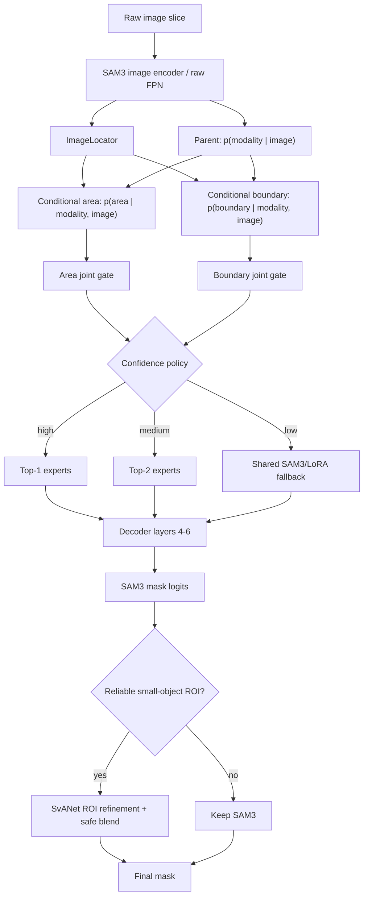

# Image-Driven Conditional HMoE-SAM3

面向 MR/US 医学图像分割的图像驱动条件式 Hierarchical Mixture of Experts（HMoE），结合共享
LoRA 专家、无提示安全路由和可选 SvANet 小目标局部细化。

本仓库的部署目标是：外部只提供一张 image slice，在没有 GT mask、GT bbox、模态标签、面积标签
或边界标签时，模型仍能独立完成路由和分割。训练标签只用于监督或有限期 teacher forcing，不是
推理输入。

详细的方法审查、设计依据和远端验收标准见 [技术报告.txt](技术报告.txt)；消融实验说明见
[ablation/README.md](ablation/README.md)。

## 1. 方法概览

### 1.1 条件式层次路由

默认方法使用 prompt 融合前的图像 FPN 特征 (I) 预测父、子路由：

```text
p(m, a | I) = p(m | I) p(a | m, I)
p(m, b | I) = p(m | I) p(b | m, I)
```

- 父节点 (m)：MR / US。
- 面积子节点 (a)：small / medium / large。
- 边界子节点 (b)：clear / fuzzy / complex。
- 面积与边界是父节点下的两个条件式兄弟分支，不是“面积之后再按边界分裂”的三层串行树。
- 两个子路由均输出 `[B, 2, 3]` 条件分布，实际专家 gate 是父、子概率的联合分布
  `[B, 2, 3]`。

系统共包含 12 个低秩专家：

```text
2 modalities × (3 area experts + 3 boundary experts) = 12 experts
```

这 12 个专家构成一个共享 `ExpertPool`。每个 routed projection 保留原 SAM3/共享 LoRA 基础
输出，再叠加面积和边界专家残差。主配置在 decoder 第 4–6 层的
`cross_attn.q_proj`、`cross_attn.v_proj` 注入，因此通常产生 6 个 routed projections。
注入层与 projection 由配置控制，不再写死在注入函数中。

### 1.2 严格的图像路由

默认 `moe.routing_feature_source=backbone_fpn`。路由器从
`Sam3DualViTDetNeck.convs` 捕获 text/geometry prompt 融合前的原始视觉 FPN：

- `ImageLocator` 从 FPN 预测 prompt-independent 粗前景；
- 模态路由使用全局图像 embedding；
- 面积和边界路由结合全局特征与 locator 软 ROI；
- `q3` 仍用于生成 `coarse_mask_p3` 辅助输出，但默认不参与专家分类路由；
- `decoder_memory` 仅作为旧路径/提示泄漏诊断消融，不是主方法。

`find_input.img_ids` 用于将图像 batch 与 query batch 严格对齐。索引、batch、device 或空间尺寸
不一致时会直接报错，不做可能掩盖输入错误的静默回退。

### 1.3 置信度感知执行

主配置启用 `confidence_routing`：

| 路由置信度 | 执行策略 |
|---|---|
| `confidence >= 0.70` | 对面积/边界分支分别执行联合 Top-1 |
| `0.35 <= confidence < 0.70` | 对面积/边界分支分别执行联合 Top-2 |
| `confidence < 0.35` | 专属专家 gate 置零，回到 shared SAM3/LoRA 路径 |

每条分支的置信度取父模态置信度与预测父分支下子类别置信度的较小值。shared fallback 是低置信度
安全策略，不会被统计成某个虚假的 MR/US 专家。

每个 projection 的面积/边界残差缩放相互独立，默认初值为 0.1、绝对值上限为 1.0，以降低新专家
在训练早期破坏已有 in-domain 能力的风险。

### 1.4 Prompt curriculum 与 teacher 退火

训练期 prompt 概率在 20 个 epoch 内线性变化：

| Prompt | 初始概率 | 最终概率 |
|---|---:|---:|
| image only | 0.30 | 0.70 |
| text | 0.10 | 0.10 |
| coarse box | 0.40 | 0.20 |
| accurate box | 0.20 | 0.00 |

- image-only 模式没有 bbox，只使用固定任务 token `prostate`；
- coarse box 由标注框扩张并抖动，只用于训练或提示鲁棒性测试；
- evaluation mode 固定为 image-only；
- route teacher forcing 从 0.5 线性下降到 0，epoch 10 后完全使用预测路由；
- GT ROI teacher forcing 同样从 0.5 下降到 0；
- eval/inference 始终设置 `routing_targets=None`。

固定 `prostate` 是单器官任务的内部任务定义，不是 slice-specific GT prompt。如果未来一个模型
需要同时分割多个可能目标，调用方仍需说明目标类别，因为图像本身不能定义用户希望分割哪个器官。

### 1.5 安全 SvANet 细化

SvANet 网络结构不变，`SvANetROIAdapter` 只负责 ROI 选择和 logits 融合：

1. 仅对预测为 small 且置信度满足要求的样本考虑细化；
2. ROI 候选顺序为 locator → 可选 box → skip；
3. 没有可靠 ROI 时跳过细化并保留 SAM3 输出，不默认整图运行 SvANet；
4. ROI 内默认以 0.35 权重融合 SvANet 与 SAM3 logits；
5. ROI 外始终保留 SAM3 logits。

旧的 full-image fallback、ROI 硬替换和 ROI 外清零仅保留为消融变体。

## 2. 推理数据流



路由的执行时机位于 decoder 第 3 层之后，但默认分类信息来自此前缓存的原始 FPN；此时生成的
`q3/P3` 只承担 SAM3 辅助分割监督，不向默认分类路由提供 prompt-conditioned 信息。

## 3. 目录与正式入口

```text
sam3-finetune/
├── train.sh                         # 顶层唯一正式训练脚本
├── test.sh                          # 顶层唯一正式测试脚本
├── README.md
├── 技术报告.txt
├── MedSAM3-main/
│   ├── train_moe_sam3.py            # 单卡/多卡训练入口
│   ├── train_sam3_lora_native.py    # 数据、train/val loop、checkpoint
│   ├── infer_moe_sam3.py            # 纯 image slice / 兼容 split 推理
│   ├── test_moe_sam3_prompts.py     # 多提示协议测试与指标汇总
│   ├── configs/
│   │   ├── moe_sam3_train_from_scratch.yaml
│   │   └── test.yaml
│   ├── data/patient_dataset.py
│   ├── models/
│   │   ├── router.py
│   │   ├── moe_lora.py
│   │   ├── moe_injector.py
│   │   ├── moe_losses.py
│   │   ├── runtime_config.py
│   │   ├── svanet_roi_adapter.py
│   │   ├── training_stages.py
│   │   └── training_metrics.py
│   └── tests/
├── ablation/
│   ├── run.sh                       # 正式消融启动脚本
│   ├── study.yaml                   # 方法、suite 与 seeds
│   ├── run_ablation.py
│   ├── summarize_ablation.py
│   └── test_ablation.py
├── SvANet-main/                     # SvANet 上游代码
├── data-preprocess/                 # 一次性生成训练数据（COCO/box/patient/标签缓存）
│   ├── run_preprocess.sh            # 预处理入口，与 train.sh 同样的配置约定
│   ├── preprocess.py
│   ├── test_preprocess.py
│   └── README.md
├── unified_preprocess_and_coco_20260410.py
└── trans_format.py
```

`MedSAM3-main` 和 `SvANet-main` 中保留的其他 shell/Python 文件属于上游实现或调试工具；正式
训练、测试和消融分别使用上面列出的三个入口。

## 4. 环境

`MedSAM3-main/setup.py` 声明 Python >= 3.8，`requirements.txt` 声明 PyTorch >= 2.7.0。
完整 SAM3 训练需要带 CUDA 的 PyTorch 环境。

```bash
cd MedSAM3-main
python -m venv .venv
source .venv/bin/activate
python -m pip install --upgrade pip
python -m pip install -r requirements.txt
python -m pip install -e .
```

3D 医学影像预处理额外需要：

```bash
python -m pip install SimpleITK
```

三个正式启动脚本都根据脚本自身位置解析仓库目录，因此可以将仓库克隆到不同服务器路径。
默认 Conda 初始化位置仍为：

```text
/mnt/afs/zhemin/miniconda3/etc/profile.d/conda.sh
```

如服务器的 Conda 位置或环境名不同，可在启动时设置 `CONDA_SH`、`CONDA_ENV`。本地代码审查
机器没有相同的 `/mnt/afs` 数据与 checkpoint，因此不能在本机完成真实 GPU 训练。

## 5. 数据

### 5.1 目录与 patient-first 选择

patient 目录必须使用纯数字名称：

```text
dataset/
├── mr-2d/
│   ├── train/1/slice_0000.png
│   ├── val/1/slice_0000.png
│   ├── test/1/slice_0000.png
│   └── *_sam3.json
├── mr-mask-2d/
│   ├── train/1/slice_0000.png
│   └── ...
├── us-2d/
└── us-mask-2d/
```

`PatientDataset` 先选择 patient，再展开其 slices。可以显式提供 patient IDs，也可以按数量随机
或顺序选择。训练/验证 patient 列表、COCO JSON、box JSON、面积/边界阈值路径均在主配置中固定。

### 5.2 预处理

`unified_preprocess_and_coco_20260410.py` 将 3D MR/US 数据转换为二维 PNG 和初始 COCO。
脚本使用顶部常量而非命令行参数，运行前需检查数据根目录、模态、spacing、view 和输出目录。

`trans_format.py` 将初始 COCO 转成训练使用的最终 COCO，并单独生成 SAM3 XYXY box：

```bash
python trans_format.py \
  --input-json /path/to/train_initial.json \
  --mask-root /path/to/mask-root \
  --output-json /path/to/train_sam3.json \
  --boxes-json /path/to/train_boxes_xyxy.json \
  --category-name prostate
```

COCO 内的 `bbox` 仍是 `[x,y,w,h]`；单独的 box prompt JSON 使用
`[x1,y1,x2,y2]`。若 COCO segmentation 为空，必须配置可解析的 mask root。

以上产物（最终 COCO、SAM3 box JSON、train/val patient manifest、面积/边界阈值、逐 slice 的
area/boundary 标签缓存）可以用 `data-preprocess/run_preprocess.sh` 一次性生成并校验：
标签缓存把训练启动时每 slice 约 0.4–3 s 的现算变成直接读 JSON（当前配置 23k slice，
缓存后每个数据集约 13 s）。用法见 [data-preprocess/README.md](data-preprocess/README.md)。

### 5.3 路由标签的作用

训练数据会派生 modality、area、boundary 和 area-ratio 标签。这些字段用于监督路由器、locator
和统计，不会在 image-only evaluation/inference 时传给模型。面积与边界阈值只能用 train patients
计算，不能用 validation/test 数据重新拟合。

## 6. 主配置

正式训练配置为：

```text
MedSAM3-main/configs/moe_sam3_train_from_scratch.yaml
```

关键方法字段如下：

```yaml
model:
  moe_decoder_layers: [4, 5, 6]
  moe_target_modules: [cross_attn.q_proj, cross_attn.v_proj]

moe:
  conditional_hierarchy: true
  use_image_locator: true
  routing_feature_source: backbone_fpn
  confidence_routing: true
  confidence_low_threshold: 0.35
  confidence_high_threshold: 0.70
  confidence_top_k: 2
  confidence_fallback: shared
  router_regularizer: batch_prior
  residual_scale_init: 0.1
  residual_scale_max: 1.0
  learnable_residual_scale: true

router:
  routing_type: top1
  teacher_forcing:
    enabled: true
    start_ratio: 0.5
    end_ratio: 0.0
    decay_epochs: 10

dataset:
  prompt_curriculum:
    enabled: true
    fixed_text: prostate
    decay_epochs: 20
    evaluation_mode: image_only

svanet:
  roi_chunk_size: 1
  max_roi_per_step: 1
  activation_checkpointing: true
  empty_mask_fallback: locator_then_box_then_skip
  paste_mode: blend_with_sam3
  outside_roi: sam3
  fusion_weight: 0.35

training:
  amp: true
  amp_dtype: bfloat16
```

`models/runtime_config.py` 统一合并 `model`、`moe` 和 `router` 中的兼容字段，训练、测试和
推理构造相同的网络。若 `moe` 与旧 `model.moe_*` 字段同时存在，以显式 `moe` 字段为准；
`router.routing_type` 会覆盖 routing mode。

不要替换主配置中的现有 `/mnt/afs` 数据、COCO、threshold、SAM3 或 ResNet checkpoint 路径；
这些路径对应实际训练服务器。

## 7. 训练

### 7.1 正式 Stage-5 训练

在远端工程根目录执行：

```bash
bash train.sh
```

`train.sh` 默认使用 Stage 5、GPU 0 和上述主配置。可通过环境变量覆盖运行参数：

```bash
GPU_IDS="2 3" bash train.sh
RESUME=/path/to/stage5_step_last.pt bash train.sh
CONFIG=/path/to/compatible.yaml GPU_IDS="0" bash train.sh
```

主配置是直接联合训练：Stage 1–4 checkpoint 为空，从 SAM3 权重、共享/专家 LoRA 初始化和
SvANet backbone 初始化开始。旧 checkpoint 不含 ImageLocator 和条件子路由参数，不能把
`strict=False` 后未训练的新参数当作当前方法结果；需要重新训练或充分微调。

### 7.2 五阶段机制

代码仍支持分阶段训练：

| Stage | 名称 | 默认可训练组 | 生效损失 |
|---:|---|---|---|
| 1 | baseline | shared LoRA | SAM3 core、P3 auxiliary |
| 2 | router | router、auxiliary head | P3 auxiliary、locator、modality、area、area ratio、boundary router |
| 3 | MoE | expert LoRA | SAM3 core、boundary segmentation、route regularizer |
| 4 | SvANet | SvANet | refinement |
| 5 | joint | router、auxiliary head、expert LoRA、decoder 4–6、SvANet | 全部方法损失 |

主配置通过 `stages.train_shared_lora_stage5=true` 额外训练 shared LoRA。Stage 5 允许
`svanet.enable=false`，供 no-refinement 消融使用。

直接运行 Python 入口的示例：

```bash
cd MedSAM3-main
python train_moe_sam3.py \
  --config configs/moe_sam3_train_from_scratch.yaml \
  --stage 5 \
  --device 0
```

多 GPU 会由入口自动使用 `torch.distributed.run` 启动。CPU Gloo 回归测试覆盖了
`find_unused_parameters=True`、整批 shared fallback 以及 forward 外 router loss 的 DDP 图可达性。

### 7.3 Resume 与 checkpoint

完整 stage checkpoint 保存 model、controller/router、专家与共享 LoRA、可选 SvANet、optimizer、
scheduler、FP16 GradScaler、稳定参数名布局、DDP world size、RNG、patient IDs、阈值、epoch、
batch progress 和 best metric。

`training.checkpoint_interval_steps=500` 时会原子更新 `stage5_step_last.pt`。精确的
mid-epoch 恢复要求：

- 使用相同 GPU 数量；
- 保持数据集、per-device batch size 与 `data_order_seed` 不变；
- `num_workers=0`，以便随机增强可以精确重放。

### 7.4 显存安全默认值

主配置针对 A800 MIG 40 GiB 环境启用 BF16 AMP。SvANet ROI 以 `roi_chunk_size=1` 执行，并用
non-reentrant activation checkpoint 在反向时逐 crop 重算；训练期从满足条件的 ROI 中均匀抽取
一个计算细化损失，避免同一 optimizer step 保留多份 202M 参数细化网络的激活图。该 cap 只影响
训练监督：eval/inference 会处理全部满足条件的 ROI，并仍按 chunk 控制瞬时显存。
单 crop 路径将 SvANet BatchNorm 作为 Frozen-BN 使用预训练 running statistics，同时保留 affine
参数训练；这是 ASPP `1×1` 分支在 batch size 1 下的显式策略。显存允许时可在验证后将
`max_roi_per_step` 与 `roi_chunk_size` 同时设为 2，使有效双 crop batch 更新 BN statistics。

SAM3 输入在进入原始 SvANet 前会从 `[-1,1]` 反归一化到 `[0,1]`。若未来 SvANet checkpoint
要求额外标准化，可配置 `svanet_image_mean/std`。

若日志在 `backward()` 显示 `NVML_SUCCESS == r`，先查看程序输出的
`allocated/reserved/peak/free/total` 显存记录。仍不足时优先减小 `training.batch_size`；不要通过修改
数据或 checkpoint 路径规避该问题。启动脚本不再强制 `expandable_segments`，但会继承调用方显式
设置的 `PYTORCH_CUDA_ALLOC_CONF`。

### 7.5 Loss

`HierarchicalMoELoss` 的组件包括：

- `sam3_loss`：完整 native SAM3 core loss，包括分类/presence、box L1/GIoU、mask focal 和 Dice；
- `aux_loss`：`coarse_mask_p3` 的 Dice + BCE；
- `locator_loss`：ImageLocator 的 Dice + BCE；
- `modality_loss`；
- `area_loss` 与 `area_reg_loss`；
- `boundary_router_loss` 与 `boundary_seg_loss`；
- `load_balance_loss`：主配置实际为 batch-prior 路由正则；
- `refine_loss`。

### 7.6 W&B

W&B 由主配置的 `wandb.*` 或 `train_moe_sam3.py` 参数控制，只在 rank 0 记录。API key 只从
`--wandb-api-key` 或 `WANDB_API_KEY` 读取，不应写进 YAML：

```bash
export WANDB_API_KEY="your-key"
bash train.sh
```

需要禁用或离线运行时，应复制兼容配置并设置 `wandb.use_wandb=false` 或
`wandb.wandb_mode=offline/disabled`；也可以直接运行 Python 入口并传
`--wandb-mode disabled`。仓库不存在 `debug.sh` 正式入口。

## 8. 正式测试

```bash
CHECKPOINT=/path/to/stage5_joint_best.pt bash test.sh
```

`test.sh` 使用 `configs/test.yaml`，分别评估：

- `none`；
- `text`；
- `coarse_box`；
- `box`；
- `text_box`。

测试脚本在模型 forward 前移除 object targets 和 segmentation；GT mask 只在 forward 后由评估器
单独读取，用于 Dice、IoU、HD95、precision、recall 及 patient-level 汇总。该测试用于比较提示
鲁棒性，其中带 box 的模式不是纯 image-only 部署协议；最终无提示结论应以 `none`/image-only
结果为主。

## 9. 纯 Slice 推理

### 9.1 单张图像

```bash
cd MedSAM3-main
python infer_moe_sam3.py \
  --checkpoint /path/to/stage5_joint_best.pt \
  --image /path/to/slice.png \
  --task-text prostate \
  --output-dir outputs/single_slice
```

### 9.2 图像目录

```bash
python infer_moe_sam3.py \
  --checkpoint /path/to/stage5_joint_best.pt \
  --image-dir /path/to/slices \
  --task-text prostate \
  --output-dir outputs/slice_directory
```

`--image` 与 `--image-dir` 互斥。raw slice 会 resize 到 1008×1008，并按 mean/std=0.5
归一化。该入口明确保证：

- 不读取 annotation、mask、modality、area 或 boundary 文件；
- `objects=[]`、`object_ids_output=[]`；
- bbox、points、semantic target 和 raw images 均为空；
- collator 使用 `with_seg_masks=False`；
- validation interactive steps 强制为 0；
- forward 前后均不提供路由 GT target。

`--split` 保留为兼容模式，但模型输入仍会重建为固定 task token、无 bbox、无 object target 的
datapoint；GT 路径只保留在模型外 metadata 中用于评估和落盘。

每个样本输出 `original_image.png`、`sam3_mask.png`、`final_mask.png` 和
`prediction.json`；仅在兼容 split 存在 GT 路径时额外保存 `gt_mask.png`。

## 10. 消融实验

消融矩阵包含 31 个方法（含 `full_v2`）× 3 个默认 seeds，共 93 个训练 cell。覆盖：

- conditional hierarchy 与独立并行子分类器；
- backbone FPN 与 decoder-memory 路由源；
- locator、prompt curriculum 与 prompt-rich/image-only 训练；
- adaptive confidence、固定 Top-1/Top-2；
- 无/有限期/永久 teacher routing；
- batch-prior、uniform 与无路由正则；
- expert rank、注入层、projection 和 residual scale；
- 无 SvANet、旧不安全融合及细化门控；
- confidence、teacher decay、fusion weight 和 locator 容量敏感性。

远端默认运行 primary suite，每个实验使用 GPU 0/1 双卡：

```bash
bash ablation/run.sh
```

常用变体：

```bash
# 只审查 smoke 命令，不启动训练
SUITE=smoke DRY_RUN=1 bash ablation/run.sh

# GPU 0、1 各运行一个独立单卡实验
DEVICE_SETS="0 1" bash ablation/run.sh

# 两组双卡实验并行，使用 5 个 seeds
DEVICE_SETS="0,1 2,3" SEEDS="13 29 42 73 101" bash ablation/run.sh
```

配置与路径检查：

```bash
python ablation/run_ablation.py validate --suite all
python ablation/run_ablation.py list --suite primary
```

结果汇总：

```bash
python ablation/summarize_ablation.py --suite primary --epoch best
```

生成器禁止实验 override 修改数据、COCO、threshold 和 checkpoint 路径。汇总器按相同 seed 做
paired difference、bootstrap CI、paired sign-flip test 和 Holm 校正。完整设计与公平性约束见
[ablation/README.md](ablation/README.md)。

## 11. 验证与诊断

本地验证结果：

```text
MedSAM3-main/tests:       58 passed
ablation tests:           12 passed
ablation path validation: 93/93 cells
```

复现单元测试：

```bash
cd MedSAM3-main
pytest tests -q

cd ..
python -m unittest discover -s ablation -p 'test_*.py' -v
python ablation/run_ablation.py validate --suite all
```

常用诊断工具位于 `MedSAM3-main/tools/`：

- `check_moe_dataset.py`：数据和派生标签；
- `debug_moe_forward.py`：完整 forward 与 route shape；
- `check_expert_gradients.py`：稀疏专家梯度；
- `visualize_svanet_roi.py`：ROI 与融合结果；
- `compute_area_thresholds.py`、`compute_boundary_thresholds.py`：仅基于 train patients 计算阈值。

## 12. 结果解释与限制

- “条件式 HMoE”描述的是当前概率分解和专家 gate，不保证未知域每张 slice 都路由正确。
- 路由阈值 `0.35/0.70` 和 temperature=1 是初值，应在独立 validation patients 上校准。
- 旧 checkpoint 缺少 locator/条件子路由参数，不能直接作为当前方法的有效 checkpoint。
- 本地测试验证了接口、输入隔离、路由计算、DDP 和配置生成，没有完成远端真实数据上的 GPU
  训练，因此不能据此宣称 Dice/HD95 已提高。
- 正式结论应同时报告 patient-macro 与 slice 指标、MR/US 和面积/边界子组、routing accuracy、
  calibration、fallback 比例、SvANet 触发/跳过比例、参数量、吞吐和显存。
- 当前不支持 `resample_patients_each_epoch=true` 或 MR/US 两套独立 SvANet；AMP 支持 BF16 和
  带 GradScaler 的 FP16，主配置使用 BF16。
- 单器官内部 token 不能直接推广为无需任务定义的多器官分割接口。

建议先运行 smoke suite，再完成 3-seed primary 筛选；最终论文主比较至少使用 5 个配对 seeds，
并以 patient 为主要统计单位。
